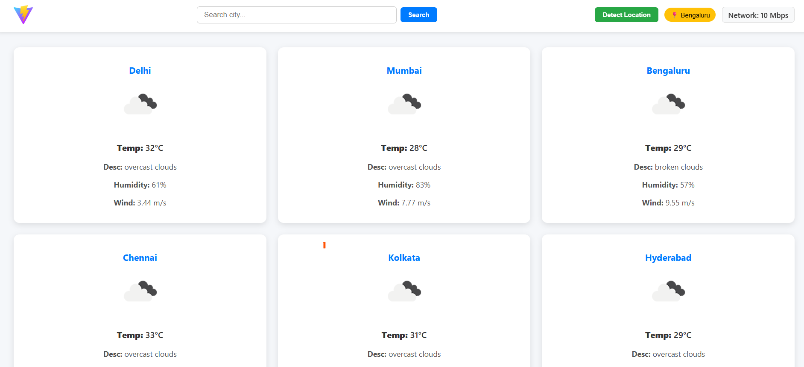
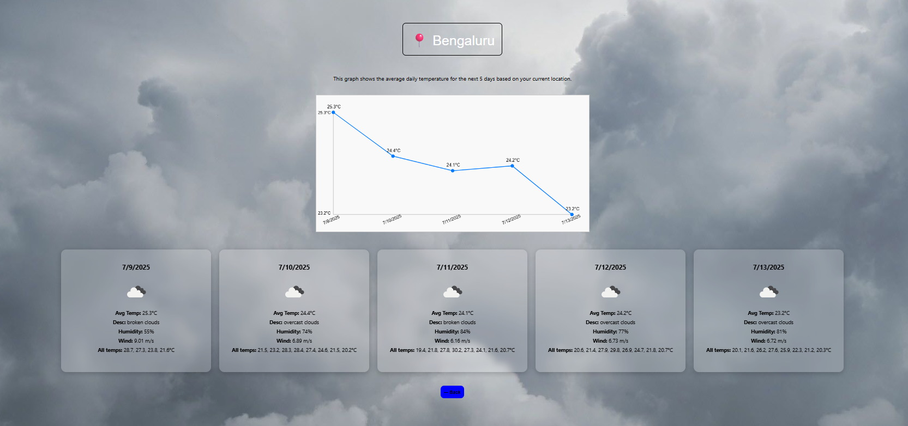

# GeoWeather

[Live Demo on Netlify](https://weather-predictor-app1.netlify.app/)

A modern, responsive weather web application that displays current weather and 5-day forecasts for major Indian cities and searched locations. The app features a beautiful UI, dynamic background changes based on weather conditions, and network information display.

## Features
- **City Weather Cards:** Shows weather for 5-6 major Indian cities on the home page.
- **City Search:** Search for any city to view its current weather and forecast.
- **Detect Location:** Detects your current location and displays weather for your city.
- **5-Day Forecast:** Click any city card to view a graph and cards for the 5-day forecast.
- **Dynamic Background:** The forecast page background changes based on weather description (rain, clear, cloud, etc.) using conditional rendering.
- **Network Info:** Displays your current network downlink speed in the navbar.
- **Responsive Design:** Works beautifully on all screen sizes.

## Technologies Used
- React (with functional components and hooks)
- React Router DOM
- Axios
- CSS (modular, responsive, and component-scoped)
- OpenWeatherMap API
- BigDataCloud Reverse Geocoding API (for location detection)
- Network Information API (used to detect user's network speed and quality dynamically)
- used to render the 5-day temperature trend graph visually in the forecast/details page


## Installation
1. Clone the repository:
   ```sh
   git clone <your-repo-url>
   cd voice-app/w
   ```
2. Install dependencies:
   ```sh
   npm install
   ```
3. Start the development server:
   ```sh
   npm run dev
   ```

## Usage
- On the home page, view weather for major cities or search for any city.
- Click "Detect Location" to get weather for your current location.
- Click any city card to view a 5-day forecast with a temperature graph and detailed cards.
- The background on the forecast page changes based on the weather (rain, clear, cloud, etc.).
- Network speed is shown in the navbar and updates dynamically.

## Example Screenshot
![Weather App Screenshot] 
  
## API & Dependencies
- [OpenWeatherMap API](https://openweathermap.org/api) (for weather data)
- [BigDataCloud Reverse Geocoding API](https://www.bigdatacloud.com/geocoding-apis/reverse-geocode-client) (for location to city name)
- [Axios](https://axios-http.com/)
- [React Router DOM](https://reactrouter.com/)

## Folder Structure
```
voice-app/w/
├── src/
│   ├── component/
│   │   ├── Navbar.jsx / Navbar.css
│   │   ├── Home.jsx
│   │   ├── Get_graph.jsx / Get_graph.css
│   │   ├── CardComponent.jsx
│   │   ├── CanvasGraph.jsx
│   │   ├── Geo_location.jsx
│   │   └── Get_network.jsx
│   ├── App.jsx
│   └── App.css
├── public/
│   └── vite.svg
├── package.json
└── README.md
```

## How to Contribute
Pull requests are welcome! For major changes, please open an issue first to discuss what you would like to change.


## Author
- Tushar Narendra Koli

---

**Conditional Rendering for Background:**
- In `Get_graph.jsx`, the background image of the forecast page is set dynamically based on the weather description (rain, cloud, clear, snow, mist, etc.) using a helper function and inline style. This provides a visually immersive experience for different weather conditions.
